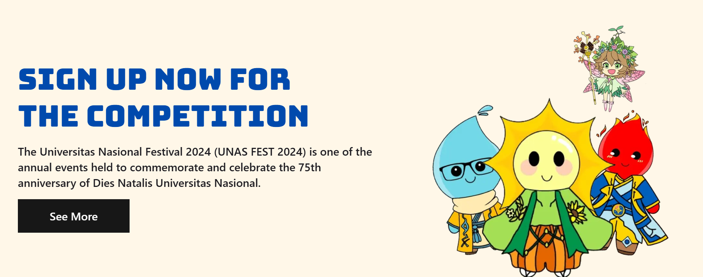

# 🎉 UNAS FEST 2025 - Official Website

<div align="center">



**Celebrating 76 Years of Excellence**

*"Conducting a Preventive Action for Deforestation Through AI-Assisted Technology Innovation in Acquiring a Resilience and Sustainable Ecosystem"*

[](https://nextjs.org/)
[](https://www.typescriptlang.org/)
[](https://tailwindcss.com/)

[🌐 Visit Website](https://caturnawa.unasfest.com) | [📚 Documentation](#documentation) | [🤝 Partnership](#partnership)

</div>

---

## 📖 About UNAS FEST

**UNAS FEST 2025** (Universitas Nasional Festival 2025) is the annual flagship event celebrating the **76th anniversary** of Universitas Nasional. This prestigious national academic and creative festival serves as a dynamic platform for students across Indonesia to showcase their talents, critical thinking, and innovative solutions to global challenges.

### 🎯 Vision

To develop students' critical, analytical, creative, innovative, adaptive, fair, and competitive thinking skills while raising global awareness about environmental issues, climate change, and sustainable development through AI-driven technology innovation.

### 🌟 Mission

- **🎓 Skill Development**: Enhance students' organizational soft and hard skills through comprehensive event management experience
- **🌍 Global Awareness**: Foster understanding of deforestation prevention and ecosystem resilience using AI technology
- **🧠 Critical Thinking**: Cultivate analytical, creative, and innovative problem-solving capabilities
- **🏆 Achievement Platform**: Provide opportunities for national and international-level competitions
- **🤝 Network Building**: Create connections between students, academics, practitioners, and industry professionals
- **🔬 Innovation Hub**: Encourage development of sustainable technology solutions for environmental challenges

---

## 🏆 Competition Categories

UNAS FEST 2025 features **5 prestigious competitions** designed to challenge and inspire participants:

### 🎤 Debate Competitions (University Level)

#### 1. **KDBI** - Kompetisi Debat Bahasa Indonesia
- **Target**: 24+ teams
- **Prize Pool**: Rp 8,000,000+
- **Format**: Indonesian Language Parliamentary Debate
- **Participants**: Active undergraduate students from Indonesian universities
- **Key Skills**: Public speaking, critical thinking, argumentation in Bahasa Indonesia

#### 2. **EDC** - English Debate Competition
- **Target**: 24+ teams
- **Prize Pool**: Rp 8,000,000+
- **Format**: British Parliamentary Debate Style
- **Participants**: Active undergraduate students from Indonesian universities
- **Key Skills**: English proficiency, analytical thinking, international debate techniques

### 📝 Academic & Creative Competitions

#### 3. **SPC** - Scientific Paper Competition
- **Target**: 15+ participants (individual)
- **Prize Pool**: Rp 6,500,000+
- **Format**: Research-based scientific paper
- **Participants**: Active undergraduate students (S1) registered in PDDIKTI
- **Key Skills**: Scientific writing, research methodology, critical analysis
- **Theme**: Environmental sustainability and AI-driven innovation

#### 4. **Infographic Competition** (High School Level)
- **Target**: 15+ teams
- **Prize Pool**: Rp 4,500,000+
- **Format**: Digital infographic design
- **Participants**: High school students (SMA/SMK) in JABODETABEK area
- **Key Skills**: Visual communication, data visualization, design thinking

#### 5. **Short Video Competition** (High School Level)
- **Target**: 15+ teams
- **Prize Pool**: Rp 4,500,000+
- **Format**: 60-180 seconds video content (9:16 portrait)
- **Participants**: High school students (SMA/SMK) in JABODETABEK area
- **Key Skills**: Video production, storytelling, digital content creation

---

## 📅 Timeline 2025

### Registration Phases
| Phase | Date | Description |
|-------|------|-------------|
| 🐦 **Early Bird** | Sep 1-7 | Special early registration rate |
| 📝 **Phase 1** | Sep 8-19 | Regular registration period |
| 📝 **Phase 2** | Sep 20-29 | Extended registration |
| ⏰ **Phase Extend** | Sep 30 - Oct 10 | Final registration opportunity |

### Key Events
- **Oct 11**: Webinar & Technical Meeting for All Competitions
- **Oct 13-15**: Preliminary & Semifinal Rounds (KDBI & EDC)
- **Oct 14-21**: Submission Period (SPC, Infographic, Short Video)
- **Oct 22-27**: Assessment & Finals Preparation
- **Oct 27**: Final Round (KDBI & EDC)
- **Nov 1**: Final Round (SPC, Infographic, Short Video)
- **Nov 6**: 🎊 **Grand Awarding Ceremony** at Universitas Nasional

---

## 💻 Technology Stack

This website is built with cutting-edge web technologies:

### Core Framework
- **⚡ Next.js 15.0** - React framework with App Router and Turbopack
- **🔷 TypeScript** - Type-safe development
- **🎨 Tailwind CSS** - Utility-first CSS framework

### UI & Animation
- **🧩 Radix UI** - Accessible component primitives
- **🎬 Framer Motion** - Production-ready animation library
- **✨ Swiper** - Modern mobile touch slider

### Development Tools
- **📏 ESLint** - Code quality enforcement
- **💅 Prettier** - Code formatting
- **🪝 usehooks-ts** - Type-safe React hooks

---

## 🏗️ Project Structure

```bash
UNAS_FEST-2025/
├── app/                      # Next.js 15 App Router
│   ├── about/               # About UNAS FEST pages
│   ├── activities/[slug]/   # Dynamic competition pages
│   ├── gallery/[slug]/      # Event photo galleries
│   ├── partnership/         # Sponsor & collaborator info
│   ├── api/visitor/         # Visitor tracking API
│   └── page.tsx            # Homepage
├── components/
│   ├── shared/              # Reusable components
│   │   ├── Home/           # Homepage sections
│   │   ├── Activities/     # Competition components
│   │   ├── Gallery/        # Gallery components
│   │   ├── Navbar/         # Navigation
│   │   └── Footer/         # Footer
│   └── ui/                  # UI primitives
├── constants/               # Static data & content
│   ├── Activities/         # Competition details
│   ├── About/              # Event information
│   ├── Home/               # Homepage content
│   ├── Gallery/            # Gallery data
│   └── Partnership/        # Partner information
├── hooks/                   # Custom React hooks
├── lib/                     # Utilities & types
│   ├── types/              # TypeScript definitions
│   └── utils.ts            # Helper functions
└── public/                  # Static assets
    ├── icons/              # Icon collections
    ├── image/              # Images & posters
    ├── file/               # Guidebook PDFs
    └── ANTHEM_UNASFEST.mp3 # Official anthem
```

---

## 🚀 Getting Started

### Prerequisites
- **Node.js** 18.0 or higher
- **npm** or **yarn** package manager
- Git

### Installation

```bash
# Clone the repository
git clone https://github.com/CatwisBot/UNAS_FEST-2025.git

# Navigate to project directory
cd UNAS_FEST-2025

# Install dependencies
npm install
# or
yarn install

# Start development server
npm run dev
# or
yarn dev
```

Open [http://localhost:3000](http://localhost:3000) to view the application.

### Available Scripts

```bash
npm run dev      # Start development server with Turbopack
npm run build    # Create production build
npm run start    # Start production server
npm run lint     # Run ESLint for code quality
```

---

## 🎨 Features

### ✨ User Experience
- **🎯 Dynamic Competition Pages**: Detailed information for each competition category
- **📱 Fully Responsive**: Optimized for mobile, tablet, and desktop
- **🌐 SEO Optimized**: Enhanced visibility on search engines
- **⚡ Lightning Fast**: Powered by Next.js 15 and Turbopack
- **🎵 Interactive Audio**: UNAS FEST anthem integration
- **📸 Photo Galleries**: Comprehensive event documentation

### 🛠️ Developer Experience
- **🔐 Type Safety**: Full TypeScript implementation
- **♻️ Reusable Components**: Modular component architecture
- **📊 Visitor Tracking**: API endpoint for analytics
- **🎨 Consistent Styling**: Tailwind CSS with custom design system
- **🔄 Hot Reload**: Instant feedback during development

---

## 📱 Pages Overview

| Route | Description |
|-------|-------------|
| `/` | Homepage with hero, competitions overview, and CTA |
| `/about` | About UNAS FEST, vision, mission, committee |
| `/activities/[slug]` | Individual competition details (KDBI, EDC, SPC, etc.) |
| `/gallery/[slug]` | Event photo galleries by category |
| `/partnership` | Sponsors, media partners, and collaborators |

---

## 🤝 Partnership

UNAS FEST 2025 is proud to collaborate with:

### 🏢 Sponsors
Organizations supporting our mission of educational excellence and innovation

### 📰 Media Partners
Media outlets amplifying our message and event coverage

### 🤝 Collaborators
Institutions and communities working together for success

**Interested in partnering with us?**  
📧 Contact: [partnership@unasfest.com](mailto:partnership@unasfest.com)

---

## 👥 Organizing Committee

The UNAS FEST 2025 committee comprises dedicated students from various study programs at Universitas Nasional, working collaboratively to create an inclusive, diverse, and impactful event.

**Committee Divisions:**
- 🎯 Steering Committee
- 📣 Public Relations & Marketing
- 💻 IT & Creative Design
- 🎪 Event Management
- 💰 Finance & Sponsorship
- 🔒 Security & Logistics

---

## 📚 Documentation

### Competition Guidebooks
All guidebooks are available in the `/public/file` directory:
- 📘 [Guidebook KDBI UNAS FEST 2025.pdf](public/file/Guidebook%20KDBI%20UNAS%20FEST%202025.pdf)
- 📘 [Guidebook EDC UNAS FEST 2025.pdf](public/file/Guidebook%20EDC%20UNAS%20FEST%202025.pdf)
- 📘 [Guidebook SPC UNAS FEST 2025.pdf](public/file/Guidebook%20SPC%20UNAS%20FEST%202025.pdf)
- 📘 [Guidebook Infographic UNAS FEST 2025.pdf](public/file/Guidebook%20Infographic%20UNAS%20FEST%202025.pdf)
- 📘 [Guidebook Short Video UNAS FEST 2025.pdf](public/file/Guidebook%20Short%20Video%20UNAS%20FEST%202025.pdf)

---

## 🌐 Links

- **🌍 Official Website**: [caturnawa.unasfest.com](https://caturnawa.unasfest.com)
- **📸 Instagram**: [@unasfest](https://instagram.com/unasfest)
- **📘 Facebook**: [UNAS FEST](https://facebook.com/unasfest)
- **🐦 Twitter**: [@unasfest](https://twitter.com/unasfest)
- **🎵 TikTok**: [@unasfest](https://tiktok.com/@unasfest)

---

## 📄 License

This project is developed and maintained by the UNAS FEST 2025 Organizing Committee.  
© 2025 Universitas Nasional. All rights reserved.

---

## 🙏 Acknowledgments

Special thanks to:
- **Universitas Nasional** for 76 years of educational excellence
- **All Committee Members** for their dedication and hard work
- **Sponsors & Partners** for their generous support
- **Participants** for making UNAS FEST a success
- **Judges & Mentors** for sharing their expertise

---

<div align="center">

### 🎊 Join Us in Celebrating 76 Years of UNAS!

**UNAS FEST 2025** - Where Innovation Meets Tradition

[Register Now](https://caturnawa.unasfest.com) | [Download Guidebooks](public/file) | [Contact Us](mailto:info@unasfest.com)

---

*Made with 💜 by UNAS FEST 2025 Committee*

</div>